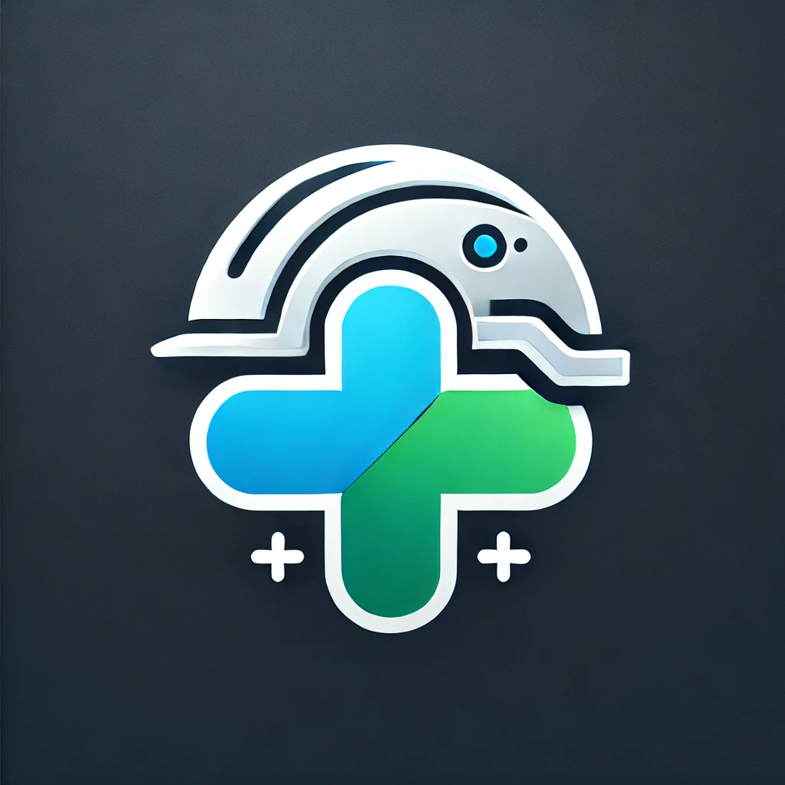
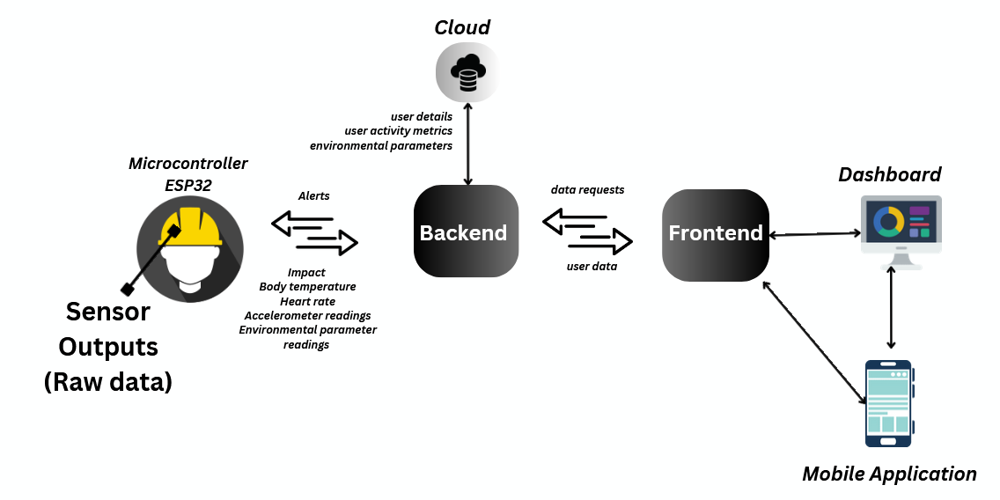
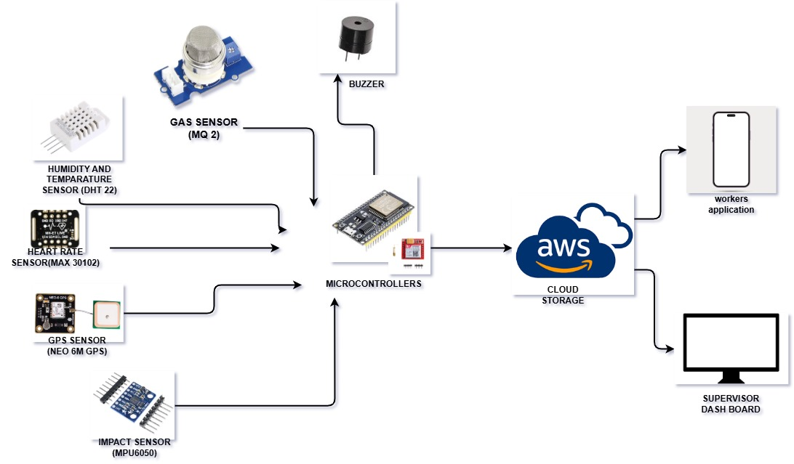
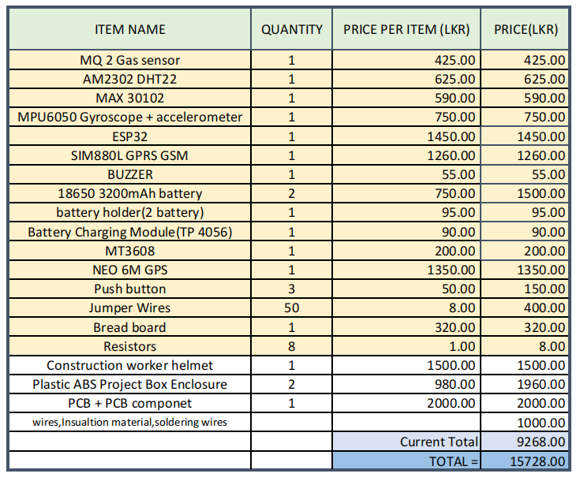

[comment]: # "This is the standard layout for the project, but you can clean this and use your own template"

# **Safe Plus - Smart Safety Helmet**

---



## Team
-  e20346, Samarakoon S.M.P.H. [email](mailto:e20346@eng.pdn.ac.lk)
-  e20378, Siriwardane I.A.U. [email](mailto:e20378@eng.pdn.ac.lk)
-  e20419, Wakkumbura M.M.S.S. [email](mailto:e20419@eng.pdn.ac.lk)
-  e20439, Wickramasinghe J.M.W.G.R.L. [email](e20439@eng.pdn.ac.lk)

<!-- Image (photo/drawing of the final hardware) should be here -->

<!-- This is a sample image, to show how to add images to your page. To learn more options, please refer [this](https://projects.ce.pdn.ac.lk/docs/faq/how-to-add-an-image/) -->

<!--  -->

#### Table of Contents
1. [Introduction](#introduction)
2. [Solution Architecture](#solution-architecture )
3. [Data Flow](#data-flow)
4. [Detailed budget](#detailed-budget)
5. [Hardware & Software Designs](#hardware-and-software-designs)
6. [Testing](#testing)
7. [Conclusion](#conclusion)
8. [Links](#links)

## Introduction

Industrial workplaces, such as construction sites, factories, and mining zones, shows significant safety risks to workers due to environmental hazards, heavy machinery, and unpredictable conditions. Every year, thousands of accidents occur due to falls, exposure to toxic gases, and collisions with moving equipment. These incidents not only lead to injuries and fatalities but also result in financial losses for companies due to medical costs, downtime, and legal repercussions.

To address these challenges, Safe Plus introduces an advanced smart safety helmet that integrates real-time monitoring, impact detection, and emergency alert systems. By providing cutting-edge sensor technology and wireless communication, Safe Plus ensures worker safety through immediate hazard detection, automated alerts, and connectivity with supervisors.

The impact of Safe Plus is much more than preventing accidents. It helps companies follow safety rules, improves worker confidence, and ensures a safer environment. This solution also keeps up with modern technology trends to make workplaces smarter and safer.

## Solution Architecture



## Data Flow



## Detailed budget

All items and costs



## Hardware and Software Designs

Detailed designs with many sub-sections

## Testing

Testing done on hardware and software, detailed + summarized results

## Environment Configuration

### Backend Configuration

The backend uses environment variables for configuration. Copy `.env.example` to `.env` in the `dashboard/SafePlus-BackEnd/` directory and configure the following variables:

```bash
# Server Configuration
PORT=8000                    # HTTP server port
WS_PORT=8085                # WebSocket server port
FRONTEND_URL=http://localhost:5173  # Frontend URL for CORS

# Database Configuration
MONGO_URL=your-mongodb-connection-string
JWT_SECRET=your-jwt-secret

# AWS IoT Configuration
PRIVATE_KEY_PATH=./certificate/private.pem.key
CERTIFICATE_PATH=./certificate/certificate.pem.crt
ROOT_CA_PATH=./certificate/AmazonRootCA1.pem
AWS_IOT_ENDPOINT=your-aws-iot-endpoint
```

### Frontend Configuration

The frontend uses environment variables for API endpoints. Copy `.env.example` to `.env` in the `Dashboard/SafePlus-FrontEnd-Dashboard/` directory:

```bash
# API Configuration
REACT_APP_API_URL=http://localhost:8000
REACT_APP_WS_URL=ws://localhost:8085
```

### Production Deployment

For production deployment, use the following environment variables:

**Backend (.env):**
```bash
PORT=8000
WS_PORT=8085
FRONTEND_URL=https://quiet-zabaione-c6e293.netlify.app
```

**Frontend (.env):**
```bash
REACT_APP_API_URL=https://e20-3yp-safeplus-production-6ef3.up.railway.app
REACT_APP_WS_URL=wss://e20-3yp-safeplus-production-6ef3.up.railway.app
```

### Running the Application

1. **Backend**: Navigate to `dashboard/SafePlus-BackEnd/` and run `npm start`
2. **Frontend**: Navigate to `Dashboard/SafePlus-FrontEnd-Dashboard/` and run `npm start`

Make sure to configure the environment variables before starting the servers.

## Conclusion

What was achieved, future developments, commercialization plans

## Links

- [Project Repository](https://github.com/cepdnaclk/{{ page.repository-name }}){:target="\_blank"}
- [Project Page](https://cepdnaclk.github.io/{{ page.repository-name}}){:target="\_blank"}
- [Department of Computer Engineering](http://www.ce.pdn.ac.lk/)
- [University of Peradeniya](https://eng.pdn.ac.lk/)

[//]: # (Please refer this to learn more about Markdown syntax)
[//]: # (https://github.com/adam-p/markdown-here/wiki/Markdown-Cheatsheet)


### Page Theme

A custom theme integrated with this GitHub Page, which is based on [github.com/cepdnaclk/eYY-project-theme](https://github.com/cepdnaclk/eYY-project-theme). If you like to remove this default theme, you can remove the file, _docs/\_config.yml_ and use HTML based website.
